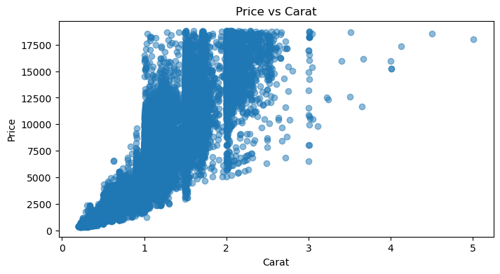

# Diamond Price Prediction: Deep Technical Analysis

## 1. 📊 OVERALL SUMMARY
*   **Goal of the Notebook**: The primary goal is to predict the price of a diamond based on its physical and qualitative characteristics.
*   **Problem Solved**: This is a classic **regression problem**. The notebook aims to build a model that can accurately estimate a continuous value (price in USD) for a diamond given its features.
*   **Dataset Used**: The notebook uses the "Diamond Price Kaggle" dataset, which contains information on over 50,000 diamonds. The features include the "4 Cs" (Carat, Cut, Color, Clarity), physical dimensions (x, y, z), and other metrics like depth and table.
*   **ML Task**: The task is **Supervised Learning**, specifically **Regression**, as the target variable (`price`) is a continuous number.

### 🔍 Key Visualization: The Price Driver

*   **What it predicts:** This scatter plot confirms the non-linear relationship between weight and price. It visualizes the "elbow" where price begins to climb exponentially, justifying why a simple Linear Regression baseline is insufficient for this project.

---

## 2. 🧱 PIPELINE BREAKDOWN (STEP-BY-STEP)

#### **Data Loading & Initial Cleaning**
*   **What is happening?**
    *   The notebook loads the `Diamond_Price_ Kaggle.csv` dataset into a pandas DataFrame.
    *   It performs an initial check for missing values using `df.isnull().sum()`.
    *   Crucially, it identifies a data quality issue: diamonds with dimensions `x`, `y`, or `z` equal to zero, which is physically impossible. These rows are dropped from the dataset.
*   **Why is it done?**
    *   Loading the data.
    *   The check for zero dimensions is a critical data cleaning step based on domain knowledge. These data points are invalid and would introduce significant noise and errors into the model. For instance, a feature like `volume` (x*y*z) would become zero, completely misrepresenting the diamond.
*   **What would happen if we skip it?**
    *   If the rows with zero dimensions were not removed, the model would learn from faulty data. This would lead to a less accurate and unreliable model. The calculated `volume` would be zero for these diamonds, breaking the strong relationship between size and price, and leading to poor predictions.

#### **Preprocessing & Feature Engineering**
*   **What is happening?**
    *   **Ordinal Encoding**: The categorical features `cut`, `color`, and `clarity` are manually mapped to numerical values. This is a form of **Ordinal Encoding**, where the assigned numbers respect the inherent order of the categories (e.g., "Fair" < "Good" < "Ideal").
    *   **Feature Creation**: The notebook later introduces new features like `volume`, `surface_area`, and `carat_squared` to better capture the diamond's properties and their non-linear relationship with price.
    *   **Target Transformation**: The `price` is log-transformed (`np.log1p`) to make its distribution more normal, which helps linear models.
    *   **Scaling**: `StandardScaler` is used within a `Pipeline` to scale numerical features. This standardizes features to have a mean of 0 and a standard deviation of 1.
*   **Why is it done?**
    *   Machine learning models require numerical input. Ordinal encoding is chosen over one-hot encoding because these features have a clear quality ranking.
    *   `StandardScaler` is essential for distance-based or coefficient-based models like Linear Regression, Ridge, and Lasso. It ensures that features with larger scales (like `carat`) do not dominate features with smaller scales (like `depth`).
    *   Log-transforming the skewed `price` variable helps linear models better fit the data, as they assume a linear relationship and are sensitive to outliers.
*   **What would happen if we skip it?**
    *   **Skipping Encoding**: The model would fail because it cannot process non-numeric string values like "Ideal" or "VVS1".
    *   **Skipping Scaling**: In models like Ridge/Lasso, features with large scales would be disproportionately penalized, leading to incorrect coefficients and a suboptimal model. The model would incorrectly assume that features with larger values are more important.
    *   **Skipping Log Transform**: Linear models would perform more poorly because the relationship between features and raw price is not perfectly linear. The model would struggle to predict the prices of very expensive diamonds accurately.

#### **Model Building & Evaluation**
*   **What is happening?**
    *   The notebook systematically trains and evaluates several regression models:
        1.  `LinearRegression` (as a baseline)
        2.  `AdaBoostRegressor`
        3.  `GradientBoostingRegressor`
        4.  `XGBRegressor`
        5.  `RandomForestRegressor`
        6.  Regularized models: `Ridge`, `Lasso`, `ElasticNet`
    *   For each model, it calculates standard regression metrics: **R² Score**, **Root Mean Squared Error (RMSE)**, and **Mean Absolute Error (MAE)** on both the training and testing sets.
*   **Why is it done?**
    *   This comparative approach is a best practice. It allows for an empirical evaluation of which algorithm performs best on this specific dataset. Starting with a simple baseline (Linear Regression) helps quantify the benefit of using more complex models.
    *   Evaluating on both train and test sets is crucial for diagnosing **overfitting** (high train score, low test score) or **underfitting** (low scores on both).
*   **What would happen if we skip it?**
    *   If only one model was built, you would have no benchmark to know if its performance is good or bad. You might deploy a suboptimal model without realizing a better alternative existed.
    *   If evaluation was skipped, you would have no objective measure of the model's accuracy or reliability.

#### **Hyperparameter Tuning**
*   **What is happening?**
    *   The notebook demonstrates three levels of hyperparameter tuning:
        1.  **Manual Tuning**: Manually changing parameters like `learning_rate` and `n_estimators` to observe their effect on performance.
        2.  **Grid Search / Random Search**: Systematically searching through a predefined grid or random sample of parameter combinations to find the best ones.
        3.  **Bayesian Optimization (Optuna)**: Using a "smart" search algorithm that learns from past trials to efficiently find the optimal parameters.
*   **Why is it done?**
    *   Default model parameters are rarely optimal for a specific dataset. Tuning is essential to find the parameter set that maximizes the model's predictive performance and helps control the bias-variance tradeoff.
*   **What would happen if we skip it?**
    *   The model would likely be either underfit or overfit. You would be leaving significant performance gains on the table, resulting in a less accurate and less generalizable model.

---

## 3. ⚙️ PARAMETER EXPLANATION (XGBoost)

#### `learning_rate` (or `eta`) in XGBoost
*   **What it means**: This parameter controls the step size at each iteration of the boosting process. It scales the contribution of each new tree that is added to the model. A smaller value means the model learns more slowly and conservatively.
*   **Why this value/range was chosen (`0.01` to `0.3`)**: This is a standard and effective range.
    *   `0.01` (low): Very conservative learning. Requires more trees (`n_estimators`) to build a good model but is highly robust against overfitting.
    *   `0.3` (high): Aggressive learning. Converges quickly but has a higher risk of overshooting the optimal solution and overfitting.
*   **How it affects**:
    *   **Model Performance**: There's a trade-off. A low `learning_rate` with a high `n_estimators` usually yields the best performance.
    *   **Bias vs. Variance**:
        *   **Decrease it**: Lowers variance, increases bias. The model becomes more conservative and less likely to overfit.
        *   **Increase it**: Increases variance, lowers bias. The model becomes more aggressive and can fit the training data more closely, risking overfitting.
    *   **Training Time**: A lower `learning_rate` requires more trees, significantly **increasing training time**.

#### `n_estimators` in XGBoost/RandomForest
*   **What it means**: The total number of decision trees to build in the ensemble.
*   **Why this value/range was chosen (`50` to `300`)**:
    *   `50`: A reasonable starting point. Too few trees will lead to underfitting.
    *   `300`: Often sufficient for good performance without excessive training time. Beyond this, performance gains tend to diminish.
*   **How it affects**:
    *   **Model Performance**: Generally, more trees lead to better performance, up to a point of diminishing returns.
    *   **Bias vs. Variance**:
        *   **Increase it**: Lowers variance. By averaging the predictions of more trees, the model becomes more stable and less sensitive to the noise in individual trees.
        *   **Decrease it**: Increases variance. The model is more likely to be influenced by the randomness of a smaller set of trees.
    *   **Training Time**: **Directly proportional**. Doubling `n_estimators` roughly doubles the training time.

#### `max_depth` in XGBoost/RandomForest
*   **What it means**: The maximum depth allowed for each individual decision tree. A deeper tree can capture more complex patterns and interactions in the data.
*   **Why this value/range was chosen (`3` to `10`)**: This range covers the most common scenarios.
    *   `3`: Shallow trees (low complexity). Each tree is a "weak learner," which is ideal for boosting.
    *   `10`: Moderately deep trees. Can capture complex interactions but starts to risk overfitting.
*   **How it affects**:
    *   **Model Performance**: Deeper trees can improve performance on complex datasets, but if too deep, they will overfit.
    *   **Bias vs. Variance**: This is the primary parameter for controlling the bias-variance tradeoff.
        *   **Increase it**: Lowers bias, increases variance. The model can fit the training data almost perfectly, leading to **overfitting**.
        *   **Decrease it**: Increases bias, lowers variance. The model is simpler and more generalizable, but may **underfit** if the data has complex patterns.
    *   **Training Time**: Deeper trees take significantly longer to build. The effect is more than linear.

#### `subsample` in XGBoost
*   **What it means**: The fraction of the training data to be randomly sampled for growing each tree. For example, `0.8` means each tree is built on a random 80% of the training data.
*   **Why this value/range was chosen (`0.6` to `1.0`)**:
    *   `1.0`: Use all data for each tree (can lead to overfitting).
    *   `0.6` - `0.8`: A common choice for introducing randomness and making the model more robust.
*   **How it affects**:
    *   **Model Performance**: Values slightly less than 1.0 often improve generalization by preventing trees from focusing on the same samples and patterns.
    *   **Bias vs. Variance**:
        *   **Decrease it**: Increases bias, lowers variance. This is a powerful regularization technique to prevent overfitting.
        *   **Increase it (to 1.0)**: Lowers bias, increases variance.
    *   **Training Time**: A smaller `subsample` value can slightly reduce training time.

#### `cv` (Cross-Validation) in `GridSearchCV`/`RandomizedSearchCV`
*   **What it means**: The number of "folds" or splits to create from the training data. If `cv=5`, the data is split into 5 parts. The model is trained on 4 parts and validated on the 5th, and this process is repeated 5 times.
*   **Why this value was chosen (`3` or `5`)**:
    *   `3`: Faster, but the performance estimate is less reliable (higher variance). Good for quick iterations.
    *   `5`: A standard, robust choice that provides a good balance between computational cost and a reliable estimate of the model's performance.
*   **How it affects**:
    *   **Model Performance**: It doesn't change the final model, but it gives a more **reliable estimate** of its performance on unseen data.
    *   **Bias vs. Variance**: A higher `cv` value gives a less biased (more accurate) estimate of the test error.
    *   **Training Time**: **Directly proportional**. `cv=5` takes 5 times longer than a single train/validation split.

---

## 4. 🧠 OPTIMIZATION STRATEGY
*   **Why are Grid Search, Random Search, and Optuna used?**
    They are used to automate the process of hyperparameter tuning. Manually testing parameter combinations is tedious and unlikely to find the optimal set. These algorithms provide a systematic way to explore the "hyperparameter space."

*   **Comparison**:

| Aspect | Grid Search | Random Search | Optuna (Bayesian Optimization) |
| :--- | :--- | :--- | :--- |
| **Speed** | **Slowest**. It exhaustively tries every single combination. | **Fast**. It only tries a fixed number (`n_iter`) of random combinations. | **Fast**. Often faster than Random Search because it focuses on promising areas. |
| **Efficiency** | **Inefficient**. Wastes a lot of time evaluating bad parameter combinations. | **More Efficient**. Quickly gets a "good enough" result by sampling the space broadly. | **Most Efficient**. It intelligently chooses the next parameters to try based on the results of previous trials. |
| **When to use** | Only when the search space is very small (e.g., 2-3 parameters with few values each). | When the search space is large and you want a good result quickly. A great starting point. | When you want the best possible performance and have a complex search space. It's the smartest choice for serious tuning. |

*   **Why is Optuna considered "smart"?**
    Optuna uses a Bayesian optimization approach. Unlike Grid or Random search, it **learns from its past evaluations**.
    1.  It builds a probabilistic model that maps hyperparameters to a score (e.g., R²).
    2.  It uses this model to decide which set of hyperparameters to try next—choosing combinations that are likely to yield a high score.
    3.  It balances **exploration** (trying new, uncertain areas) and **exploitation** (focusing on areas it already knows are good).
    This intelligent search allows it to find better parameters in fewer trials compared to random guessing.

---

## 5. ⚡ PERFORMANCE & EFFICIENCY
*   **Efficient Code Practices**:
    *   **Pipelines**: The use of `sklearn.pipeline.Pipeline` is highly efficient and robust. It encapsulates preprocessing and modeling steps, preventing data leakage and making the code cleaner and less error-prone.
    *   **Vectorization**: The code relies on `pandas` and `numpy` operations, which are vectorized and highly optimized in C, making data manipulation fast.
*   **Inefficient Code Practices**:
    *   **Manual Loops for Tuning**: The "Manual Tuning" section, while great for learning, is inefficient. It uses Python loops to test parameters one by one. Automated tools like `GridSearchCV` or `Optuna` are far more efficient as they can parallelize the work (`n_jobs=-1`).
*   **Bottlenecks**:
    *   **Hyperparameter Tuning**: The most significant bottleneck is hyperparameter tuning, especially `GridSearchCV`. This process is computationally expensive because it involves training the model many times.
    *   **Preprocessing**: For this dataset size (~54k rows), preprocessing is very fast and not a bottleneck. On much larger datasets (millions of rows), it could become more significant.
*   **When GPU Helps**:
    *   The notebook correctly identifies that GPUs are beneficial for **training tree-based models like XGBoost**, especially during hyperparameter tuning.
    *   **GPU helps most when**:
        *   The dataset is large (> 100,000 rows).
        *   The number of trees (`n_estimators`) is high (> 500).
        *   The trees are deep (`max_depth` > 6).
    *   **GPU does NOT help with**:
        *   Data loading and preprocessing with `pandas`. These are CPU-bound tasks.
        *   Models like `LinearRegression` or `Lasso`, which are not designed for massive parallelization in the same way as deep learning or tree ensembles.

---

## 6. 🚨 MISTAKES / IMPROVEMENTS
The notebook is very well-structured and follows many best practices. However, here are some potential improvements:

*   **Mistake 1: Potential Data Leakage in Manual Ordinal Encoding**
    *   **Issue**: In the first half of the notebook, the categorical features are mapped to numbers (`cut_mapping`, etc.) on the entire DataFrame *before* the `train_test_split`. While this is not as severe as scaling before splitting, it's technically a form of minor data leakage. The mapping learns all possible categories from the entire dataset.
    *   **Improvement**: The notebook corrects this later by using `OrdinalEncoder` *inside* a `Pipeline`. This is the gold standard. The encoder is fitted only on the training data, preventing any information from the test set from leaking into the training process.
*   **Mistake 2: Redundant Feature Engineering**
    *   **Issue**: The initial feature engineering maps `cut`, `color`, and `clarity` to numbers. The "Advanced Regression Analysis" section then re-defines this logic using `OrdinalEncoder`. This is redundant.
    *   **Improvement**: The initial manual mapping could be removed and `OrdinalEncoder` used from the start for consistency and to avoid repetition.
*   **Suggestion 1: Handling of `x, y, z` Dimensions**
    *   **Alternative**: Instead of dropping rows where `x, y, z` are zero, one could impute them. Since `carat` is highly correlated with these dimensions, it would be possible to predict the dimensions based on the carat weight for those few rows. However, given the small number of affected rows (less than 20), dropping them is a perfectly valid and simpler approach.
*   **Suggestion 2: Feature Selection with `Lasso`**
    *   The notebook does an excellent job of demonstrating `Lasso` for feature selection. A great next step would be to take the features selected by `Lasso` and use them to train a more powerful model like `XGBoost`. This often leads to a model that is both simpler and more performant.

---

## 7. 📈 OUTPUT INTERPRETATION
*   **R² (R-squared)**:
    *   **Meaning**: This metric represents the **proportion of the variance in the dependent variable (price) that is predictable from the independent variables (features)**. An R² of 0.98 means that 98% of the variation in diamond prices can be explained by the model's features.
    *   **Real-world terms**: A high R² (like the 0.98 achieved by the tuned XGBoost model) means the model is very effective at capturing the factors that determine a diamond's price. It's a highly accurate model.
*   **RMSE (Root Mean Squared Error)**:
    *   **Meaning**: This is the square root of the average of the squared differences between the actual and predicted prices. It's an absolute measure of error in the units of the target variable (USD).
    *   **Real-world terms**: An RMSE of **$550** means that, on average, the model's price prediction is off by about $550. Given that diamond prices in the dataset range up to ~$18,800, an average error of $550 is excellent. It gives a concrete sense of the model's prediction error in dollars.

---

## 8. 🧪 INTERVIEW-LEVEL INSIGHTS
*   **The Bias-Variance Tradeoff in Practice**: "In this project, I demonstrated the bias-variance tradeoff by comparing three models. A simple linear model using only 'carat' was **underfit (high bias)**. A complex polynomial model was **overfit (high variance)**, with a near-perfect training R² but a terrible test R². The best model, a tuned `XGBoost`, found the sweet spot, achieving a high R² on both training and test sets, indicating a **well-balanced** model."
*   **Why XGBoost is Effective Here**: "I chose `XGBoost` because it's a gradient boosting algorithm that excels at capturing complex, non-linear relationships and interactions between features, which are very common in pricing tasks. For example, the impact of 'color' on 'price' might be different for a 0.5-carat diamond versus a 3-carat diamond. `XGBoost` can model these interactions automatically, unlike linear models."
*   **Preventing Data Leakage**: "I ensured the integrity of my evaluation by using `sklearn.pipeline.Pipeline`. This encapsulates preprocessing steps like scaling, ensuring that the scaler was fitted *only* on the training data and then used to transform the test data. This prevents data leakage and provides an honest estimate of the model's performance on unseen data."
*   **Smart Hyperparameter Tuning**: "Instead of relying on a brute-force `GridSearchCV`, I used `Optuna` for hyperparameter tuning. It employs Bayesian optimization to intelligently search the parameter space, allowing me to find a better set of hyperparameters in significantly less time. This is crucial for iterating quickly and efficiently."

---

## 9. 🔑 FINAL SUMMARY
*   **Key Takeaways**:
    *   **Carat is King**: `carat` and its related dimensions (`x`, `y`, `z`, `volume`) are the most dominant drivers of diamond price.
    *   **Ordinal Features Matter**: Correctly encoding the ordered categorical features (`cut`, `color`, `clarity`) is crucial for model performance.
    *   **Ensemble Models Win**: Tree-based ensemble models like `RandomForest` and `XGBoost` significantly outperform simple linear models by capturing non-linearities and feature interactions.
    *   **Tuning is Non-Negotiable**: Default model parameters are rarely optimal. Hyperparameter tuning (especially with a smart tool like `Optuna`) provides significant performance gains.
    *   **Pipelines Prevent Errors**: Using `Pipelines` is the best practice for creating a robust, leak-proof machine learning workflow.
    *   **Regularization Works**: `Lasso` can be used for automatic feature selection, while `Ridge` helps stabilize models, especially in the presence of correlated features.
    *   **GPU Accelerates Tuning**: For complex models and large datasets, using a GPU can drastically reduce the time required for hyperparameter tuning.
*   **One-Line Intuition of the Notebook**:
    > This notebook builds a highly accurate diamond price predictor by systematically cleaning the data, encoding categorical quality grades, and using a powerful, fine-tuned `XGBoost` model to capture the complex relationships between a diamond's features and its final market value.

